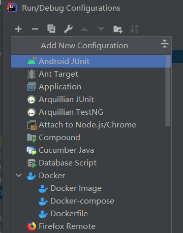
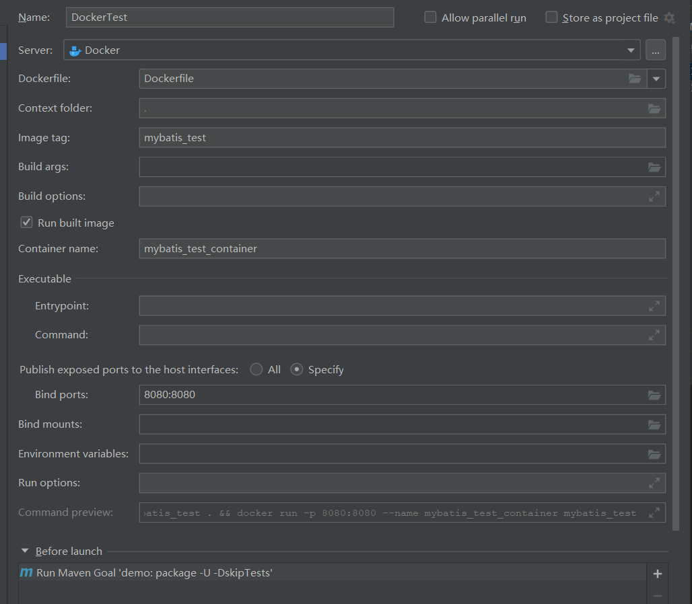

# docker+idea+springboot

## 前言

idea自身携带/可安装docker插件，docker插件支持链接远程docker服务，使得这套开发环境得以运行

## 准备工作

1.idea安装docker插件（新版idea应该自带了可以跳过）
2.docker服务所在服务器开启远程访问
3.配置远程docker server，在Settings中找到Docker，配置连接（记得测试连接是否成功）

## 使用docker部署应用的两种方案

无论哪种方案都需要编写Dockerfile

### idea的dockerfile

右上角“Edit Configuration”找到如下图所示设置选项，新建一个dockerfile

然后配置如下,其中server要提前配置好，Dockerfile为已经编写好的Dockerfile文件
Before launch中设置前置操作（至少应该先把工程打个包）


### maven的docker插件

在pom文件中增加如下配置，maven打包时自动构建镜像和部署

```xml
            <plugin>
                <groupId>com.spotify</groupId>
                <artifactId>docker-maven-plugin</artifactId>
                <version>1.0.0</version>
                <!--将插件绑定在某个phase执行-->
                <executions>
                    <execution>
                        <id>build-image</id>
                        <!--将插件绑定在package这个phase上。也就是说，
                        用户只需执行mvn package ，就会自动执行mvn docker:build-->
                        <phase>package</phase>
                        <goals>
                            <goal>build</goal>
                        </goals>
                    </execution>
                </executions>

                <configuration>
                    <!--指定生成的镜像名,这里是我们的项目名-->
                    <imageName>${project.artifactId}</imageName>
                    <!--指定标签 这里指定的是镜像的版本，我们默认版本是latest-->
                    <imageTags>
                        <imageTag>latest</imageTag>
                    </imageTags>
                    <!-- 指定我们项目中Dockerfile文件的路径-->
                    <dockerDirectory>${project.basedir}</dockerDirectory>

                    <!--指定远程docker 地址-->
                    <dockerHost>http://127.0.0.1:2375</dockerHost>

                    <!-- 这里是复制 jar 包到 docker 容器指定目录配置 -->
                    <resources>
                        <resource>
                            <targetPath>/</targetPath>
                            <!--jar包所在的路径  此处配置的即对应项目中target目录-->
                            <directory>${project.build.directory}</directory>
                            <!-- 需要包含的 jar包 ，这里对应的是 Dockerfile中添加的文件名　-->
                            <include>${project.build.finalName}.jar</include>
                        </resource>
                    </resources>
                </configuration>
            </plugin>
```
