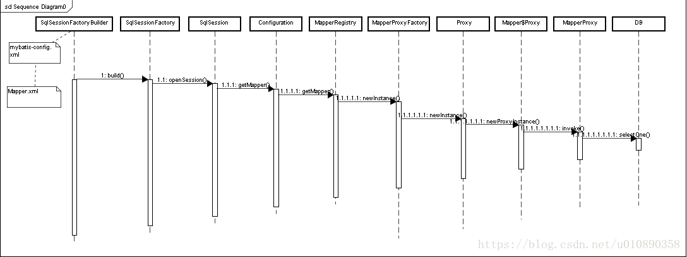
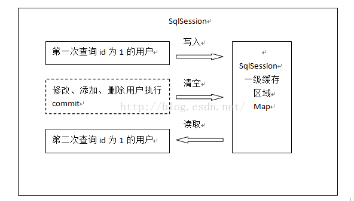
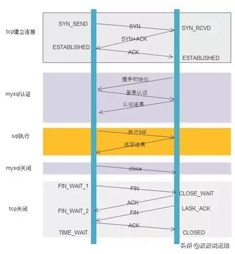

# Mybatis知识分享

## 数据持久化与数据持久层

持久化是指把内存中的数据存储到磁盘中，使得数据在程序运行结束后得以保留。通俗的理解就是把域对象保存到数据库里。
持久层功能是提供与数据库交互的能力，直接的理解就是将数据库的各种操作进行封装

## Mybatis

Mybatis是一个基于Java的数据持久层框架，没有其它依赖，使用时将jar包置入类路径即可。如使用Maven构建项目，则于pom文件中增加相关代码依赖。

### 配置

配置主要来自于配置文件和注解，注解高于配置文件

```propeties
mybatis.configuration.cache-enabled=true
mybatis.mapper-locations=classpath:mapper/*Mapper.xml
```

### Mapper

#### 基本使用方式

此处列举的是spring boot下的使用方式
创建接口类，将接口的全类名作为mapper的namespace,语句的id要与接口中对应的方法同名，接口类需要增加@Mapper注解

```java
@Mapper
@Repository
public interface UserMapper {
    public void add(UserDto dto);
}
```

```xml
<?xml version="1.0" encoding="UTF-8" ?>
<!DOCTYPE mapper PUBLIC "-//mybatis.org//DTD Mapper 3.0//EN" "http://mybatis.org/dtd/mybatis-3-mapper.dtd">

<mapper namespace="com.example.demo.mapper.UserMapper">

    <insert id="add" parameterType="com.example.demo.dto.UserDto">
        <selectKey keyProperty="id" resultType="string" order="BEFORE">
            select replace(uuid(), '-', '') as id from dual
        </selectKey>
        insert into User (id,name,sex,age)
        values (#{id},#{name},#{sex},#{age})
    </insert>
</mapper>
```

#### 动态SQL

XML映射文件中可以使用由Mybatis提供的语法实现判断逻辑、循环逻辑和局部变量，基于此实现动态生成sql语句的效果

```xml
<select id="findActiveBlogLike" resultType="Blog">
  SELECT * FROM BLOG
  <where>
    <if test="state != null">
         state = #{state}
    </if>
    <choose>
        <when test="title != null">
            AND title like #{title}
        </when>
        <when test="author != null and author.name != null">
            AND author_name like #{author.name}
        </when>
        <otherwise>
            AND featured = 1
        </otherwise>
    </choose>
  </where>
</select>
```

如要在注解中使用动态SQL，则需使用script元素

```java
@Update({"<script>",
    "update Author",
    "  <set>",
    "    <if test='username != null'>username=#{username},</if>",
    "    <if test='password != null'>password=#{password},</if>",
    "    <if test='email != null'>email=#{email},</if>",
    "    <if test='bio != null'>bio=#{bio}</if>",
    "  </set>",
    "where id=#{id}",
    "</script>"})
void updateAuthorValues(Author author);
```

该功能实际上和其他的模板语法有相似之处，如果你使用过某种模板语法，那么理解起来相对容易。换句话说，Mybatis的这部分功能可以看做是SQL模板引擎

#### Mybatis流程一览



一个没有手写sql的例子

```java
String properties = "mybatis-config.xml";
Reader reader = Resources.getResourceAsReader(properties);
SqlSessionFactory factory = new SqlSessionFactoryBuilder().build(reader);
SqlSession session = factory.openSession();
String sql = "select * from user";
PreparedStatement pst = session.getConnection().prepareStatement(sql);
ResultSet result = pst.executeQuery();
ResultSetMetaData md = result.getMetaData();
int columnCount = md.getColumnCount();
while (result.next()) {
    Map<String, Object> rowData = new HashMap<String, Object>();
    for (int i = 1; i <= columnCount; i++) {
        rowData.put(md.getColumnName(i), result.getObject(i));
    }
    list.add(rowData);
}
```

一个使用mapper的例子

```java
Reader reader = Resources.getResourceAsReader("mybatis-config.xml");
SqlSessionFactory sqlSessionFactory = new SqlSessionFactoryBuilder().build(reader);
SqlSession session = sqlSessionFactory.openSession();
try { 
    UserMapper userMapper = session.getMapper(UserMapper.class);  
    User user = new User("tom",new Integer(5));  
    userMapper.insertUser(user);  
    sqlSession.commit();
} finally {  
    sqlSession.close();  
}
```

##### SqlSessionFactory

单个数据库映射关系经过编译后的内存镜像，其主要作用是创建SqlSession对象。SqlSessionFactory对象的实例可以通过SqlSessionFactoryBuilder对象来构建，而SqlSessionFactoryBuilder则可以通过XML配置文件或一个预先定义好的Configuration实例构建出SqlSessionFactory的实例

SqlSessionFactory对象是线程安全的，它一旦被创建，在整个应用执行期间都会存在。如果我们多次地创建同一个数据库的SqlSessionFactory，那么此数据库的资源将很容易被耗尽。为了解决此问题，通常每一个数据库都会对应一个SqlSessionFactory，所以在构建SqlSessionFactory实例时，建议使用单例模式

##### SqlSession

应用程序与持久层之间执行交互操作的一个单线程对象，其主要作用是执行持久化操作。SqlSession对象包含了数据库中所有执行SQL操作的方法，由于其底层封装了JDBC连接，所以可以直接使用其实例来执行已映射的SQL语句

每一个线程都应该有一个自己的SqlSession实例，并且该实例是不能被共享的。同时，SqlSession实例也是线程不安全的，因此其使用范围最好在一次请求或一个方法中，决不能将其放在一个类的静态字段、实例字段或任何类型的管理范围（如Servlet的HttpSession）中使用。使用完SqlSession对象之后，要及时关闭它，通常可以将其放在finally块中关闭

##### MapperProxy

getMapper方法最终会走入到MapperProxy内部类PlainMethodInvoker的invoke方法中，调用了MapperMethod的execute方法，

```java
    public MapperMethod(Class<?> mapperInterface, Method method, Configuration config) {
        this.command = new MapperMethod.SqlCommand(config, mapperInterface, method);
        this.method = new MapperMethod.MethodSignature(config, mapperInterface, method);
    }

    public Object execute(SqlSession sqlSession, Object[] args) {
        Object result;
        Object param;
        switch(this.command.getType()) {
        case INSERT:
            param = this.method.convertArgsToSqlCommandParam(args);
            result = this.rowCountResult(sqlSession.insert(this.command.getName(), param));
            break;
        case UPDATE:
            param = this.method.convertArgsToSqlCommandParam(args);
            result = this.rowCountResult(sqlSession.update(this.command.getName(), param));
            break;
        case DELETE:
            param = this.method.convertArgsToSqlCommandParam(args);
            result = this.rowCountResult(sqlSession.delete(this.command.getName(), param));
            break;
        case SELECT:
            if (this.method.returnsVoid() && this.method.hasResultHandler()) {
                this.executeWithResultHandler(sqlSession, args);
                result = null;
            } else if (this.method.returnsMany()) {
                result = this.executeForMany(sqlSession, args);
            } else if (this.method.returnsMap()) {
                result = this.executeForMap(sqlSession, args);
            } else if (this.method.returnsCursor()) {
                result = this.executeForCursor(sqlSession, args);
            } else {
                param = this.method.convertArgsToSqlCommandParam(args);
                result = sqlSession.selectOne(this.command.getName(), param);
                if (this.method.returnsOptional() && (result == null || !this.method.getReturnType().equals(result.getClass()))) {
                    result = Optional.ofNullable(result);
                }
            }
            break;
        case FLUSH:
            result = sqlSession.flushStatements();
            break;
        default:
            throw new BindingException("Unknown execution method for: " + this.command.getName());
        }

        if (result == null && this.method.getReturnType().isPrimitive() && !this.method.returnsVoid()) {
            throw new BindingException("Mapper method '" + this.command.getName() + " attempted to return null from a method with a primitive return type (" + this.method.getReturnType() + ").");
        } else {
            return result;
        }
    }
```

实际上拿到mapper以后经过转换，仍要使用SqlSession封装好的方法（基于jdbc）进行数据库操作

##### Spring boot下的mapper加载

这里用到了org.mybatis.spring.boot相关的包,它帮我们初始化了SqlSessionFactory以及mapper代理对象的注册

### cache

#### 一级缓存



一级缓存是SqlSession级别的缓存。在操作数据库时需要构造 sqlSession对象，在对象中有一个(内存区域)数据结构（HashMap）用于存储缓存数据。不同的sqlSession之间的缓存数据区域（HashMap）是互相不影响的。
一级缓存的作用域是同一个SqlSession，在同一个sqlSession中两次执行相同的sql语句，第一次执行完毕会将数据库中查询的数据写到缓存（内存），第二次会从缓存中获取数据将不再从数据库查询，从而提高查询效率。当一个sqlSession结束后该sqlSession中的一级缓存也就不存在了。Mybatis默认开启一级缓存。

#### 二级缓存


二级缓存是mapper级别的缓存，多个SqlSession去操作同一个Mapper的sql语句，多个SqlSession去操作数据库得到数据会存在二级缓存区域，多个SqlSession可以共用二级缓存，二级缓存是跨SqlSession的。
二级缓存是多个SqlSession共享的，其作用域是mapper的同一个namespace，不同的sqlSession两次执行相同namespace下的sql语句且向sql中传递参数也相同即最终执行相同的sql语句，第一次执行完毕会将数据库中查询的数据写到缓存（内存），第二次会从缓存中获取数据将不再从数据库查询，从而提高查询效率。Mybatis默认没有开启二级缓存需要在setting全局参数中配置开启二级缓存。

### 数据库连接池

#### 数据库连接过程



频繁地创建和关闭数据库连接带来不必要的耗时和资源开销。对数据库连接的复用是一种自然的需求和解决方案，用空间换时间

#### Mybatis内置数据源

##### UnpooledDataSource

顾名思义，不用连接池的数据源，属于DataSource的实现类

```java
private Connection doGetConnection(Properties properties) throws SQLException {
    this.initializeDriver();
    Connection connection = DriverManager.getConnection(this.url, properties);
    this.configureConnection(connection);
    return connection;
}
```

如上代码所示，UnpooledDataSource会做以下事情：
1.初始化驱动： 判断driver驱动是否已经加载到内存中，如果还没有加载，则会动态地加载driver类，并实例化一个Driver对象，使用DriverManager.registerDriver()方法将其注册到内存中，以供后续使用。
2.创建Connection对象： 使用DriverManager.getConnection()方法创建连接。
3.配置Connection对象： 设置是否自动提交autoCommit和隔离级别isolationLevel。
4.返回Connection对象
**每调用一次getConnection()方法，都会通过DriverManager.getConnection()返回新的java.sql.Connection实例，所以没有连接池**

##### PooledDataSource

使用用连接池的数据源，也属于DataSource的实现类

```java
private PooledConnection popConnection(String username, String password) throws SQLException {
        boolean countedWait = false;
        PooledConnection conn = null;
        long t = System.currentTimeMillis();
        int localBadConnectionCount = 0;

        while(conn == null) {
            synchronized(this.state) {
                PoolState var10000;
                if (!this.state.idleConnections.isEmpty()) {
                    conn = (PooledConnection)this.state.idleConnections.remove(0);
                    ...
                } else if (this.state.activeConnections.size() < this.poolMaximumActiveConnections) {
                    conn = new PooledConnection(this.dataSource.getConnection(), this);
                    ...
                } else {
                    PooledConnection oldestActiveConnection = (PooledConnection)this.state.activeConnections.get(0);
                    long longestCheckoutTime = oldestActiveConnection.getCheckoutTime();
                    if (longestCheckoutTime > (long)this.poolMaximumCheckoutTime) {
                        ++this.state.claimedOverdueConnectionCount;
                        var10000 = this.state;
                        var10000.accumulatedCheckoutTimeOfOverdueConnections += longestCheckoutTime;
                        var10000 = this.state;
                        var10000.accumulatedCheckoutTime += longestCheckoutTime;
                        this.state.activeConnections.remove(oldestActiveConnection);
                        if (!oldestActiveConnection.getRealConnection().getAutoCommit()) {
                            try {
                                oldestActiveConnection.getRealConnection().rollback();
                            } catch (SQLException var15) {
                                log.debug("Bad connection. Could not roll back");
                            }
                        }

                        conn = new PooledConnection(oldestActiveConnection.getRealConnection(), this);
                        conn.setCreatedTimestamp(oldestActiveConnection.getCreatedTimestamp());
                        conn.setLastUsedTimestamp(oldestActiveConnection.getLastUsedTimestamp());
                        oldestActiveConnection.invalidate();
                        ...
                    } else {
                        try {
                            if (!countedWait) {
                                ++this.state.hadToWaitCount;
                                countedWait = true;
                            }

                            if (log.isDebugEnabled()) {
                                log.debug("Waiting as long as " + this.poolTimeToWait + " milliseconds for connection.");
                            }

                            long wt = System.currentTimeMillis();
                            this.state.wait((long)this.poolTimeToWait);
                            var10000 = this.state;
                            var10000.accumulatedWaitTime += System.currentTimeMillis() - wt;
                        } catch (InterruptedException var16) {
                            break;
                        }
                    }
                }

                if (conn != null) {
                    if (conn.isValid()) {
                        if (!conn.getRealConnection().getAutoCommit()) {
                            conn.getRealConnection().rollback();
                        }

                        conn.setConnectionTypeCode(this.assembleConnectionTypeCode(this.dataSource.getUrl(), username, password));
                        conn.setCheckoutTimestamp(System.currentTimeMillis());
                        conn.setLastUsedTimestamp(System.currentTimeMillis());
                        this.state.activeConnections.add(conn);
                        ++this.state.requestCount;
                        var10000 = this.state;
                        var10000.accumulatedRequestTime += System.currentTimeMillis() - t;
                    } else {
                        if (log.isDebugEnabled()) {
                            log.debug("A bad connection (" + conn.getRealHashCode() + ") was returned from the pool, getting another connection.");
                        }

                        ++this.state.badConnectionCount;
                        ++localBadConnectionCount;
                        conn = null;
                        if (localBadConnectionCount > this.poolMaximumIdleConnections + this.poolMaximumLocalBadConnectionTolerance) {
                            if (log.isDebugEnabled()) {
                                log.debug("PooledDataSource: Could not get a good connection to the database.");
                            }

                            throw new SQLException("PooledDataSource: Could not get a good connection to the database.");
                        }
                    }
                }
            }
        }

        if (conn == null) {
            if (log.isDebugEnabled()) {
                log.debug("PooledDataSource: Unknown severe error condition.  The connection pool returned a null connection.");
            }

            throw new SQLException("PooledDataSource: Unknown severe error condition.  The connection pool returned a null connection.");
        } else {
            return conn;
        }
    }
```

如上代码所示，PooledDataSource会做以下事情：
1.先看是否有空闲(idle)状态下的PooledConnection对象，如果有，就直接返回一个可用的PooledConnection对象；否则进行第2步。
2.查看活动状态的PooledConnection池activeConnections是否已满；如果没有满，则创建一个新的PooledConnection对象，然后放到activeConnections池中，然后返回此PooledConnection对象；否则进行第三步；
3.看最先进入activeConnections池中的PooledConnection对象是否已经过期：如果已经过期，从activeConnections池中移除此对象，然后创建一个新的PooledConnection对象，添加到activeConnections中，然后将此对象返回；否则进行第4步。
4.线程等待，循环2步

##### PooledDataSource下的Connection回收

PooledDataSource的getConnection方法返回的实际上是PooledConnection，它实现了InvocationHandler，当调用close方法时，实际上是归还了Connection

```java
public Object invoke(Object proxy, Method method, Object[] args) throws Throwable {
        String methodName = method.getName();
        if ("close".equals(methodName)) {
            this.dataSource.pushConnection(this);
            return null;
        } else {
            try {
                if (!Object.class.equals(method.getDeclaringClass())) {
                    this.checkConnection();
                }

                return method.invoke(this.realConnection, args);
            } catch (Throwable var6) {
                throw ExceptionUtil.unwrapThrowable(var6);
            }
        }
    }
```

##### JNDI

姑且理解为使用JNDI进行连接池管理的数据源

#### 动态数据源及动态最大连接数

不做赘述

## Mybatis与Hibernate

### jdbc

jdbc（Java DataBase Connectivity）是java连接数据库操作的原生接口。jdbc是所有框架操作数据库的必须要用的，由数据库厂商提供，但是为了方便java程序员调用各个数据库，各个数据库厂商都要实现jdbc接口

### jpa

jpa（Java Persistence API）是java持久化规范，是orm框架的标准，主流orm框架都实现了这个标准

### ORM

Object/Relational Mapping，对象关系映射

面向对象编程把所有实体看成对象（object），关系型数据库则是采用实体之间的关系（relation）连接数据。关系也可以用对象表达，ORM 就是通过实例对象的语法，完成关系型数据库的操作的技术

数据库的表（table） --> 类（class）
记录（record，行数据）--> 对象（object）
字段（field）--> 对象的属性（attribute）

Hibernate是一个关系映射框架，Mybatis不是

#### ORM的优点

数据模型都在一个地方定义，更容易更新和维护，也利于重用代码。
ORM 有现成的工具，很多功能都可以自动完成，比如数据消毒、预处理、事务等等。
它迫使你使用 MVC 架构，ORM 就是天然的 Model，最终使代码更清晰。
基于 ORM 的业务代码比较简单，代码量少，语义性好，容易理解。
你不必编写性能不佳的SQL。

#### ORM的缺点

ORM 库不是轻量级工具，需要花很多精力学习和设置。
对于复杂的查询，ORM 要么是无法表达，要么是性能不如原生的 SQL。
ORM 抽象掉了数据库层，开发者无法了解底层的数据库操作，也无法定制一些特殊的 SQL。

### Mybatis与Hibernate的关系

hibernate是一个标准的orm框架，实现jpa接口。
mybatis也是一个持久化框架，但不完全是一个orm框架，不是依照的jpa规范。

通常来说，使用Mybatis需要更好的SQL编写能力，而使用Hibernate需要更好的模型构建能力。另外当使用自行研发的sql引擎时，要为Hibernate自行开发相应的Driver
实际上是没时间去看hibernate的实现。。。
