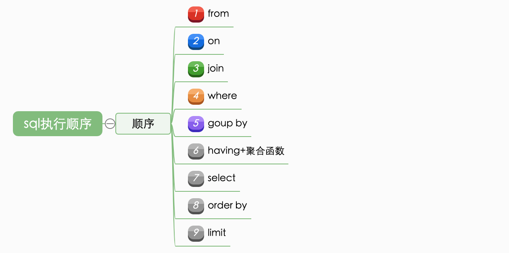
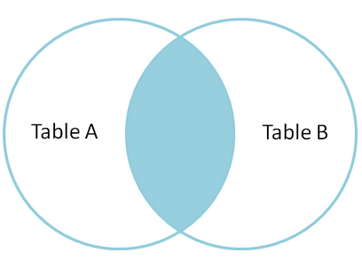
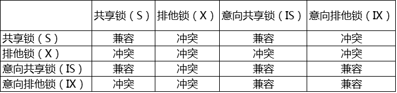

# MySql知识分享

## MySql

MySQL是一个关系型数据库管理系统，由瑞典MySQL AB公司开发，目前属于Oracle公司

### SQL与MySql

sql-92、sql-99都属于sql标准，mysql和oracle（还有别的）属于满足/部分满足这些标准的方言

### sql执行过程

#### 连接器

mysql中存在4个控制权限的表，分别为user表，db表，tables_priv表，columns_priv表

* **User表**:存放用户账户信息以及全局级别（所有数据库）权限，决定了来自哪些主机的哪些用户可以访问数据库实例
* **Db表**:存放数据库级别的权限，决定了来自哪些主机的哪些用户可以访问此数据库 
* **Tables_priv表**：存放表级别的权限，决定了来自哪些主机的哪些用户可以访问数据库的这个表
* **Columns_priv表**：存放列级别的权限，决定了来自哪些主机的哪些用户可以访问数据库表的这个字段
* **Procs_priv表**：存放存储过程和函数级别的权限

mysql权限表的验证过程为：

1.先从user表中的Host,User,Password这3个字段中判断连接的ip、用户名、密码是否存在，存在则通过验证。
2.通过身份认证后，进行权限分配，按照user，db，tables_priv，columns_priv的顺序进行验证。即先检查全局权限表user，如果user中对应的权限为Y，则此用户对所有数据库的权限都为Y，将不再检查db, tables_priv,columns_priv；如果为N，则到db表中检查此用户对应的具体数据库，并得到db中为Y的权限；如果db中为N，则检查tables_priv中此数据库对应的具体表，取得表中的权限Y，以此类推

如果在任何一个过程中权限验证不通过,都会报错。另外，当一个连接建立之后，连接里的权限逻辑判断都依赖于上述权限验证过程中读取到的权限数据。也就是说，连接未断开时，管理员修改用户权限，无法立即生效

#### 缓存

5.6以后默认关闭，8开始删除了缓存相关功能
实际上是推荐在客户端侧做缓存

#### 分析器

sql解析，包括预处理与解析过程，在这个阶段会解析sql语句的语义，并进行关键词和非关键词进行提取、解析，并组成一个解析树。此过程会察觉到语法错误

#### 优化器

能够进入到优化器阶段表示sql是符合mysql的标准语义规则的并且可以执行的，此阶段主要是进行sql语句的优化，会根据执行计划进行最优的选择,匹配合适的索引,选择最佳的执行方案

#### 执行器

在执行器的阶段,此时会调用存储引擎的API,API会调用存储引擎。下图是主要的存储引擎，其中常用的是InnoDB和myisam

##### sql执行顺序

#### 日志

##### 重做日志（redo log）

来自InnoDB，确保事务的持久性。防止在发生故障的时间点，尚有脏页未写入磁盘，在重启mysql服务的时候，根据redo log进行重做，从而达到事务的持久性这一特性
事务开始时即开始陆续写入，而非等到事务提交时。redo log具有缓存区，在以下三个时机会将缓存区的日志刷新到磁盘：

* Master Thread 每秒一次执行刷新InnoDB_log_buffer到重做日志文件。
* 每个事务提交时会将重做日志刷新到重做日志文件。
* 当重做日志缓存可用空间 少于一半时，重做日志缓存被刷新到重做日志文件

另外，即使某个事务还没有提交，InnoDB存储引擎仍然每秒会将重做日志缓存刷新到重做日志文件

##### 回滚日志（undo log）

也来自InnoDB，保存了事务发生之前的数据的一个版本，可以用于回滚，同时可以提供多版本并发控制下的读（MVCC），也即非锁定读

##### 二进制日志（binlog）

binlog是记录所有数据库表结构变更（例如CREATE、ALTER TABLE…）以及表数据修改（INSERT、UPDATE、DELETE…）的二进制日志。基于此实现 MySQL 数据库的恢复和主从复制

### SELECT *

1、mysql拿到一条命令，会去解析命令、优化查询，然后去存储引擎执行查找.SELECT * 语句取出表中的所有字段，会解析更多的对象，字段，权限，属性相关,不论该字段的数据对调用的应用程序是否有用，这会对服务器资源造成浪费，导致优化和效率问题,对服务器的性能产生一定的影响

2、如果表的结构在以后发生了改变，那么SELECT * 语句可能会取到不正确的数据甚至是出错。

3、执行SELECT \* 语句时，SELECT * 语句要对表中所有列进行权限检查,这部分也是开销

4、使用SELECT * 语句将不会使用到覆盖索引，不利于查询的性能优化.(索引覆盖:索引覆盖是一种速度极快,效率极高,业界推荐的一种查询方式.就是select的数据列只用从索引中就能够获得,不必从数据表中读取,也就是查询列要被所使用的索引覆盖)

### 关联查询

#### inner join、cross join、join

内连接，也叫等值连接，inner join产生同时符合A和B的一组数据（笛卡尔积，有on生效的时候是全集的子集）
inner join、cross join、join三者是等价的

#### left join & right join

外连接查询的结果=内连接结果+主表中有而从表中没有的记录  

#### full join

Mysql不支持full join，但是可以通过left join 和 right join结果集的union来模拟

#### on和where

on用于生成临时表，而where用于过滤临时表
left join的时候，结果不满足on条件的数据仍会进入到临时表中，这意味着使用inner join的时候可以通过尽可能的将过滤条件置入on中来优化性能，但是使用left join时不可以，因为结果会不一致

### 视图

视图（view）是一种虚拟存在的表，是一个逻辑表，本身并不包含数据。作为一个select语句保存在数据字典中的

### 索引

实际上，索引也是一张表，该表保存了主键与索引字段，并指向实体表的记录，建立索引会占用磁盘空间的索引文件

* **优点**
索引大大减小了服务器需要扫描的数据量
索引可以帮助服务器避免排序和临时表
索引可以将随机IO变成顺序IO

* **缺点**
虽然索引大大提高了查询速度，同时却会降低更新表的速度，如对表进行INSERT、UPDATE和DELETE。因为更新表时，MySQL不仅要保存数据，还要保存索引文件。
建立索引会占用磁盘空间的索引文件。一般情况这个问题不太严重，但如果你在一个大表上创建了多种组合索引，索引文件的会膨胀很快。
如果某个数据列包含许多重复的内容，为它建立索引就没有太大的实际效果。
对于非常小的表，大部分情况下简单的全表扫描更高效

InnoDB使用的是b+树实现索引，b树b+树此处不做讨论

#### 索引的创建方式

* 直接创建索引
* 修改表结构(添加索引)
* 创建表的时候直接指定

#### 建索引的几大原则

1.最左前缀匹配原则，非常重要的原则，mysql会一直向右匹配直到遇到范围查询(>、<、between、like)就停止匹配，比如a = 1 and b = 2 and c > 3 and d = 4 如果建立(a,b,c,d)顺序的索引，d是用不到索引的，如果建立(a,b,d,c)的索引则都可以用到，a,b,d的顺序可以任意调整

2.=和in可以乱序，比如a = 1 and b = 2 and c = 3 建立(a,b,c)索引可以任意顺序，mysql的查询优化器会帮你优化成索引可以识别的形式。

3.尽量选择区分度高的列作为索引，区分度的公式是count(distinct col)/count(*)，表示字段不重复的比例，比例越大我们扫描的记录数越少，唯一键的区分度是1，而一些状态、性别字段可能在大数据面前区分度就是0

4.索引列不能参与计算，保持列“干净”，比如from_unixtime(create_time) = ’2014-05-29’就不能使用到索引，原因很简单，b+树中存的都是数据表中的字段值，但进行检索时，需要把所有元素都应用函数才能比较，显然成本太大。所以语句应该写成create_time = unix_timestamp(’2014-05-29’)。

5.尽量的扩展索引，不要新建索引。比如表中已经有a的索引，现在要加(a,b)的索引，那么只需要修改原来的索引即可。

### 事务

维基百科的定义：事务是数据库管理系统（DBMS）执行过程中的一个逻辑单位，由一个有限的数据库操作序列构成
Mysql只有使用InnoDB引擎的情况下才支持事务，事务处理可以用来维护数据库的完整性，保证成批的 SQL 语句要么全部执行，要么全部不执行
事务用来管理insert,update,delete语句

#### ACID

事务的实现需要满足的特性

* **原子性（Atomic）**
一个事务（transaction）中的所有操作，要么全部完成，要么全部不完成，不会结束在中间某个环节。事务在执行过程中发生错误，会被回滚（Rollback）到事务开始前的状态，就像这个事务从来没有执行过一样
* **一致性（Consistency）**
在事务开始之前和事务结束以后，数据库的完整性没有被破坏。这表示写入的资料必须完全符合所有的预设规则，这包含资料的精确度、串联性以及后续数据库可以自发性地完成预定的工作
* **隔离性（Isolcation）**
数据库允许多个并发事务同时对其数据进行读写和修改的能力，隔离性可以防止多个事务并发执行时由于交叉执行而导致数据的不一致。事务隔离分为不同级别，包括读未提交（Read uncommitted）、读提交（read committed）、可重复读（repeatable read）和串行化（Serializable）
* **持久性（Durability）**
事务处理结束后，对数据的修改就是永久的，即便系统故障也不会丢失

#### 事务操作

在MySQL 命令行的默认设置下，事务都是自动提交的，即执行 SQL 语句后就会马上执行 COMMIT操作

显示开启事务可以自行决定事务提交的时机

**BEGIN** 开始一个事务
**ROLLBACK** 事务回滚
**COMMIT** 事务确认

记得加分号

#### 锁

MySQL不同的存储引擎支持不同的锁机制，此处分析InnoDB提供的锁
InnoDB存储引擎既支持行级锁，也支持表级锁，但默认情况下是采用行级锁
InnoDB 实现了以下两种类型的行锁：
**共享锁（S）**：允许一个事务去读一行，阻止其他事务获得相同数据集的排他锁。
**排他锁（X）**：允许获得排他锁的事务更新数据，阻止其他事务取得相同数据集的共享读锁和排他写锁。
为了允许行锁和表锁共存，实现多粒度锁机制，InnoDB 还有两种内部使用的意向锁（Intention Locks），这两种意向锁都是表锁：
**意向共享锁（IS）**：事务打算给数据行加行共享锁，事务在给一个数据行加共享锁前必须先取得该表的 IS 锁。
**意向排他锁（IX）**：事务打算给数据行加行排他锁，事务在给一个数据行加排他锁前必须先取得该表的 IX 锁。

InnoDB加锁方法：
意向锁是 InnoDB 自动加的， 不需用户干预。
对于 UPDATE、 DELETE 和 INSERT 语句，InnoDB会自动给涉及数据集加排他锁（X)；
对于普通 SELECT 语句，InnoDB 不会加任何锁；
事务可以通过以下语句显式给记录集加共享锁或排他锁：
共享锁（S）：SELECT \* FROM table_name WHERE ... LOCK IN SHARE MODE。 其他 session 仍然可以查询记录，并也可以对该记录加 share mode 的共享锁。但是如果当前事务需要对该记录进行更新操作，则很有可能造成死锁。
排他锁（X)：SELECT * FROM table_name WHERE ... FOR UPDATE。其他 session 可以查询该记录，但是不能对该记录加共享锁或排他锁，而是等待获得锁

##### 锁与索引

InnoDB 行锁是通过给索引上的索引项加锁来实现的，这一点MySQL与Oracle不同，后者是通过在数据块中对相应数据行加锁来实现的。InnoDB这种行锁实现特点意味着：只有通过索引条件检索数据，InnoDB才使用行级锁，否则，InnoDB将使用表锁
多个session是访问不同行的记录， 但是如果是使用相同的索引键，是会出现锁冲突的（后使用这些索引的session需要等待先使用索引的session释放锁后，才能获取锁）

## 数据库中间件

数据库中间件的主要作用是向应用程序开发人员屏蔽读写分离和分库分表面临的挑战，并隐藏底层实现细节，使得开发人员可以像操作单库单表那样去操作数据。

### 历史表

按时间对表进行拆分

### 垂直拆分

大致上可以概括为，将同一数据库内的多张表，按业务拆分到多个数据库中。也有少量情况是将一张大表拆分成数个小表

### 读写分离

设置主从复制数据库集群，写主库，读从库，主库需将数据同步至从库，从库可看作主库的全量备份。主要是为了解决单数据库并发访问量过高的问题，将压力分散

#### 实现关键点

* **基本读写分离功能**：对sql类型进行判断，如果是select等读请求，就走从库，如果是insert、update、delete等写请求，就走主库。
有些场景下需要强制sql语句强行走主库，一般由中间件提供语法标记或者api来实现
* **主从数据同步延迟问题**：因为数据是从master节点通过网络同步给多个slave节点，因此必然存在延迟。因此有可能出现我们在master节点中已经插入了数据，但是从slave节点却读取不到的问题。对于一些强一致性的业务场景，要求插入后必须能读取到，因此对于这种情况，我们需要提供一种方式，让读请求也可以走主库，而主库上的数据必然是最新的。
* **事务问题**：如果一个事务中同时包含了读请求(如select)和写请求(如insert)，如果读请求走从库，写请求走主库，由于跨了多个库，那么本地事务已经无法控制，属于分布式事务的范畴。而分布式事务非常复杂且效率较低。因此对于读写分离，目前主流的做法是，事务中的所有sql统一都走主库，由于只涉及到一个库，本地事务就可以搞定。
* **感知集群信息变更**：如果访问的数据库集群信息变更了，例如主从切换了，写流量就要到新的主库上；又例如增加了从库数量，流量需要可以打到新的从库上；又或者某个从库延迟或者失败率比较高，应该将这个从库进行隔离，读流量尽量打到正常的从库上

### 分库、分表

#### 分库分表的形式

分库、分表、分库+分表

#### 好处

* **存储能力的水平扩展**
在读写分离的情况下，每个集群中的master和slave基本上数据是完全一致的，从存储能力来说，在存在海量数据的情况下，可能由于磁盘空间的限制，无法存储所有的数据。而在分库分表的情况下，我们可以搭建多个mysql主从复制集群，每个集群只存储部分分片的数据，实现存储能力的水平扩展
* **写能力的水平扩展**
在读写分离的情况下，由于每个集群只有一个master，所有的写操作压力都集中在这一个节点上，在写入并发非常高的情况下，这里会成为整个系统的瓶颈。
而在分库分表的情况下，每个分片所属的集群都有一个master节点，都可以执行写入操作，实现写能力的水平扩展。此外减小建立索引开销，降低写操作的锁操作耗时等，都会带来很多显然的好处。

#### 挑战

* **基本的数据库增删改功能**
简单来说就是中间件要做到将一条sql语句按照目标库表自动生成出多条语句，并能够将结果集合并
* **分布式id**
在分库分表后，我们不能再使用mysql的自增主键。因为在插入记录的时候，不同的库生成的记录的自增id可能会出现冲突。因此需要有一个全局的id生成器。目前分布式id有很多中方案，其中一个比较轻量级的方案是twitter的snowflake算法
* **分布式事务**
分布式事务是分库分表绕不过去的一个坎，因为涉及到了同时更新多个分片数据。关于分布式事务，mysql支持XA事务，但是效率较低。柔性事务是目前比较主流的方案，柔性事务包括：最大努力通知型、可靠消息最终一致性方案以及TCC两阶段提交。但是无论XA事务还是柔性事务，实现起来都是非常复杂的。
* **动态扩容**
填坑

### 分布式事务

无论是读写分离还是分库分表，都涉及到分布式事务。

#### CAP原则

CAP原则又称CAP定理，指的是在一个分布式系统中， Consistency（一致性）、 Availability（可用性）、Partition tolerance（分区容错性），三者不可得兼

* **分区容错**
以实际效果而言，分区相当于对通信的时限要求。系统如果不能在时限内达成数据一致性，就意味着发生了分区的情况，必须就当前操作在C和A之间做出选择一般来说，分区容错无法避免，因此可以认为CAP的P总是成立。CAP 定理告诉我们，剩下的C和A无法同时做到
* **可用性**
在集群中一部分节点故障后，集群整体是否还能响应客户端的读写请求
* **一致性**
在分布式系统中的所有数据备份，在同一时刻是否同样的值

#### BASE理论

BASE理论是在CAP理论的基础之上的延伸。包括基本可用（Basically Available）、柔性状态（Soft State）、最终一致性（Eventual Consistency）

* **基本可用**：分布式系统出现故障的时候，允许损失一部分可用性，常见为降级处理。
* **柔性状态**：允许系统存在中间状态，这个中间状态又不会影响系统整体可用性。比如，数据库读写分离，写库同步到读库（主库同步到从库）会有一个延时，这样实际是一种柔性状态。
* **最终一致性**：经过数据同步延时之后，最终数据能达到一致。

柔性事务对ACID的支持：
1、原子性：严格遵循
2、一致性：事务完成后的一致性严格遵循，事务中的一致性可适当放宽
3、隔离性：并行事务间不可影响；事务中间结果可见性允许安全放宽
4、持久性：严格遵循

#### 柔性事务的实现方式

主要有四种，两阶段型、补偿型、异步确保型、最大努力型

1、两阶段型
就是分布式事务两阶段提交，对应技术上的XA、JTA/JTS。这是分布式环境下事务处理的典型模式。

2、补偿型
TCC型事务（Try/Confirm/Cancel）可以归为补偿型

* **Try**：资源预留&锁定。事务发起方将调用服务提供方的Try方法来锁定业务所需要的所有资源。
* **Confirm**：确认执行业务逻辑操作。这里使用的资源一定都是在Try中预留的资源，Try + Confirm 组合起来是一次完整的业务逻辑。
* **Cancel**：取消执行业务逻辑。这里和普通的补偿性事务不同，因为Try阶段只是预留资源，并未真正执行操作，因此取消操作只需要释放Try阶段预留的资源，而不需要执行数据库操作来补偿。

3、异步确保型
将一些同步阻塞的事务操作变为异步的操作，避免对数据库事务的争用，典型例子是热点账户异步记账、批量记账的处理。

4、最大努力型
交易的消息通知与失败重试（例如商户交易结果通知重试、补单重试）

### 数据库中间件设计方案

主要有proxy和smart-client两种设计方案

#### proxy

我们独立部署一个代理服务，这个代理服务背后管理多个数据库实例。而在应用中，我们通过一个普通的数据源(c3p0、druid、dbcp等)与代理服务器建立连接，所有的sql操作语句都是发送给这个代理，由这个代理去操作底层数据库，得到结果并返回给应用。在这种方案下，分库分表和读写分离的逻辑对开发人员是完全透明的。

优点：

1 多语言支持。也就是说，不论你用的php、java或是其他语言，都可以支持。以mysql数据库为例，如果proxy本身实现了mysql的通信协议，那么你可以就将其看成一个mysql 服务器。mysql官方团队为不同语言提供了不同的客户端却动，如java语言的mysql-connector-java，python语言的mysql-connector-python等等。因此不同语言的开发者都可以使用mysql官方提供的对应的驱动来与这个代理服务器建通信。

2 对业务开发同学透明。由于可以把proxy当成mysql服务器，理论上业务同学不需要进行太多代码改造，既可以完成接入。

缺点：

1 实现复杂。因为proxy需要实现被代理的数据库server端的通信协议，实现难度较大。通常我们看到一些proxy模式的数据库中间件，实际上只能代理某一种数据库，如mysql。几乎没有数据库中间件，可以同时代理多种数据库(sqlserver、PostgreSQL、Oracle)。

2 proxy本身需要保证高可用。由于应用本来是直接访问数据库，现在改成了访问proxy，意味着proxy必须保证高可用。否则，数据库没有宕机，proxy挂了，导致数据库无法正常访问，就尴尬了。 

3 租户隔离。可能有多个应用访问proxy代理的底层数据库，必然会对proxy自身的内存、网络、cpu等产生资源竞争，proxy需要需要具备隔离的能力。

#### smart-client

业务代码需要进行一些改造，引入支持读写分离或者分库分表的功能的sdk，这个就是我们的smart-client。通常smart-client是在连接池或者driver的基础上进行了一层封装，smart-client内部与不同的库建立连接。应用程序产生的sql交给smart-client进行处理，其内部对sql进行必要的操作，例如在读写分离情况下，选择走从库还是主库；在分库分表的情况下，进行sql解析、sql改写等操作，然后路由到不同的分库，将得到的结果进行合并，返回给应用。

优点：

1 实现简单。proxy需要实现数据库的服务端协议，但是smart-client不需要实现客户端通信协议。原因在于，大多数据数据库厂商已经针对不同的语言提供了相应的数据库驱动driver，例如mysql针对java语言提供了mysql-connector-java驱动，针对python提供了mysql-connector-python驱动，客户端的通信协议已经在driver层面做过了。因此smart-client模式的中间件，通常只需要在此基础上进行封装即可。

2 天然去中心化。smart-client的方式，由于本身以sdk的方式，被应用直接引入，随着应用部署到不同的节点上，且直连数据库，中间不需要有代理层。因此相较于proxy而言，除了网络资源之外，基本上不存在任何其他资源的竞争，也不需要考虑高可用的问题。只要应用的节点没有全部宕机，就可以访问数据库。(这里的高可用是相比proxy而言，数据库本身的高可用还是需要保证的)

缺点：

1 通常仅支持某一种语言。例如tddl、zebra、sharding-jdbc都是使用java语言开发，因此对于使用其他语言的用户，就无法使用这些中间件。如果其他语言要使用，那么就要开发多语言客户端。

2 版本升级困难。因为应用使用数据源代理就是引入一个jar包的依赖，在有多个应用都对某个版本的jar包产生依赖时，一旦这个版本有bug，所有的应用都需要升级。而数据库代理升级则相对容易，因为服务是单独部署的，只要升级这个代理服务器，所有连接到这个代理的应用自然也就相当于都升级了。

#### 常见MySql中间件

|实现方案|组件|优点|缺点|
|----|----|----|----|
|proxy|cobar、mycat、mysql-proxy、atlas、drds、sharding-sphere|多语言支持|实现复杂|
|smart-client|tddl、zebra、zdal、sharding-jdbc|实现难度适中、支持各种ORM框架、端到端监控|仅支持部分语言、版本升级困难|
|ORM框架代理|Hibernate-shards、mybatis插件||和框架绑定、仅支持部分语言|

cobar：阿里出品，mycat和drds的基础，已停止维护
mycat：mycat团队在cobar基础上开发
drds：阿里分布式数据库服务，阿里云上的商业产品，需结合rds使用，可以看做tddl的商业化版本
mysql-proxy：mysql团队出品
atlas：360团队在mysql-proxy的基础上开发出来的
sharding-sphere：当当网出品，目前是Apache软件基金会的顶级项目
tddl：阿里出品，开源版不再维护，输出到阿里云上的成果就是drds
zebra：大众点评开源，现在算是美团的东西了，维不维护不知道，master分支最近一次提交是十三个月前
zdal：支付宝出品
sharding-jdbc：还是当当网出品，sharding-sphere前身

实际上还有不少国外出品的，以及商业化非开源的。合理推测不少大型团队其实内部有自行维护的数据库中间件，毕竟满足自身业务场景才是首要的
根据观察，同一团队的产品基本会经历从client模式到proxy模式的变换，也可以看做是业务增长带来的需求变化，用的人多了，侵入式开发就不太能够了
drds前提是用阿里云，那基本就是往阿里全家桶走了
不执着于阿里云全家桶的话，sharding-sphere是个不错的选择
