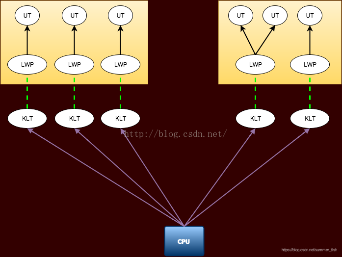
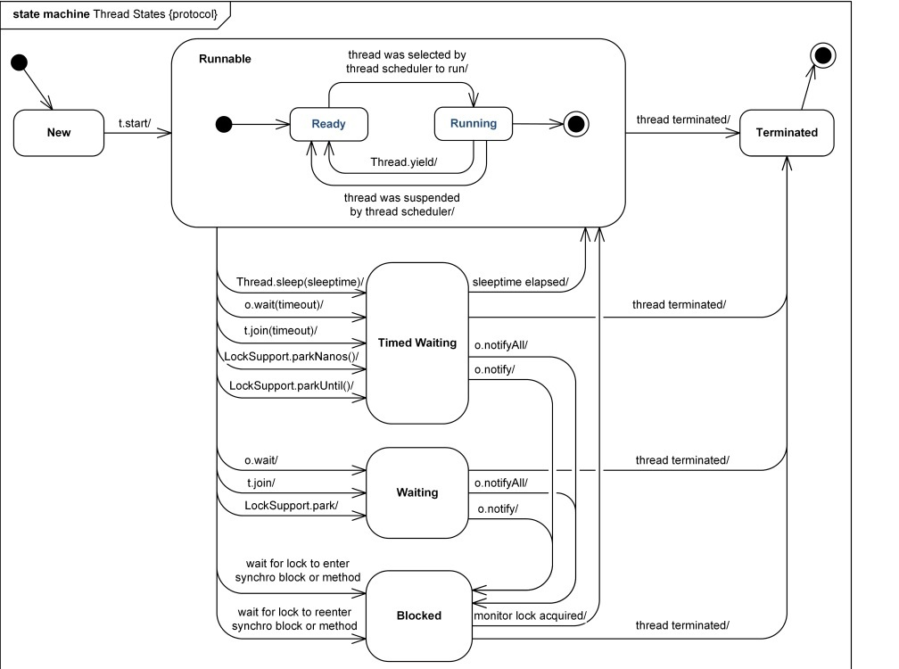
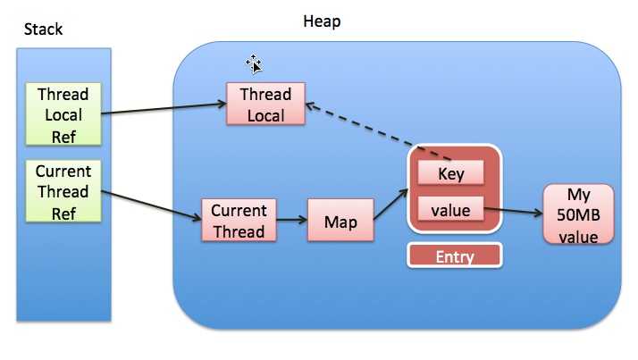

# 多线程知识点

## Java线程与OS线程



KLT：Kernel-Level Thread，内核线程
LWP：Light Weight Process，轻量级进程
UT：User Thread，用户线程

上图实际上可以体现线程实现的三种方式：
内核线程实现（左半部分）1:1
用户线程实现（右半部分）N:1
用户线程加轻量级进程混合实现（合起来）M:N

Java中的线程并不完全等价于操作系统中的线程。虽然目前主流平台的主流JVM实现采用的是1:1模型。如windows和linux平台的HotSpot VM是1:1，但Solaris平台的HotSpot VM支持M:N和1:1模型，默认1:1。

## 线程的基本使用方式

继承Thread和实现Runnable接口，并实现run方法
Thread本身也实现了Runnable的方法
Runnable本身只有一个抽象方法run
自行实现Runnable的一个好处就是可以再继承其它类

## 线程状态

初始(NEW)、运行(RUNNABLE)、阻塞(BLOCKED)、等待(WAITING)、超时等待(TIMED_WAITING)、终止(TERMINATED)  


## 线程优先级

线程可以通过设置优先级，Thread.setPriority方法
优先级的值为int类型，需在1-10之间，否则Thread会自行抛出异常
优先级值越大，优先级越高
线程优先级并不能确定线程的执行顺序。

## 线程相关操作

### 同步锁

同步代码块

```java
public void increse() {
    synchronized (obj) {
        System.out.println(Thread.currentThread().getName()+"售出："+(count--) +" 票");
    }
}
```

同步方法

```java
public synchronized void increse() {
    System.out.println(Thread.currentThread().getName()+"售出："+(count--) +" 票");
}
```

同步类

```java
public static synchronized void increse() {
    System.out.println(Thread.currentThread().getName()+"售出："+(count--) +" 票");
}
```

### 来自Thread

**sleep** 休眠指定的时间，休眠结束后恢复执行
**join** 由一个线程调用另一个线程，调用线程等待被调用线程执行完毕
**yield** 暂停执行当前线程，让更高优先级的线程有机会执行。实际上是一个重选操作，让OS重新选择要执行的线程，但并不排除当前线程，当前线程仍有机会被选中。
**stop** 停止
**interrupt** 标记线程为中断状态，并没有阻止线程的运行。该状态会影响wait、join、sleep三个方法，使被阻塞的线程抛出InterruptedException异常，以进入catch逻辑的形式被唤醒
**interrupted** 测试当前线程是否被中断并清除中断标记

### 来自Object

**wait** 将线程置入等待状态，此方法需在同步代码块/同步方法中调用
**notify** 随机唤醒一个等待中的线程进入锁池
**notifyall** 唤醒所有等待中的线程进入锁池

同一时间只能有一个线程持有对象的锁，其它试图获取锁的线程存在于锁池及等待池。等待池中的线程需要notify或notifyall的调用后才能进入锁池，而锁池中的线程可以抢占释放后的锁。

### sleep、join和wait

sleep操作并不会释放当前线程持有的锁，但是wait会

join方法被synchronized修饰，同时join方法内部执行了wait(0)。所以当主线程通过join调用子线程时，主线程进入阻塞状态，直到子线程执行结束，或者超时。B线程结束时会调用notifyAll以唤醒主线程。

```java
    public final synchronized void join(long millis)
    throws InterruptedException {
        long base = System.currentTimeMillis();
        long now = 0;

        if (millis < 0) {
            throw new IllegalArgumentException("timeout value is negative");
        }

        if (millis == 0) {
            while (isAlive()) {
                wait(0);
            }
        } else {
            while (isAlive()) {
                long delay = millis - now;
                if (delay <= 0) {
                    break;
                }
                wait(delay);
                now = System.currentTimeMillis() - base;
            }
        }
    }
```

### 来自LockSupport

**park** 阻塞线程
**unpark** 恢复指定线程

LockSupport并不需要获取对象锁，另外park和unpark的执行顺序也并非十分严格，因为它们实际上是基于一个许可变量_counter工作的，unpark会将_counter置1，而park在执行时会先判断_counter是否大于0，是则置0并返回。因此unpark还可以保证线程不受下一次park影响

## 资源共享与线程安全

线程之间可以实现资源共享，多个线程间对同一资源操作的时序不确定性导致了线程安全问题的产生。
最常见的解决方法就是使用上文提到的同步代码块。

### Lock

jdk1.5以后，并发包中新增了Lock接口及其相应的实现类来实现锁的功能，提供了和synchronized一样的同步功能，但需要手动获取锁和释放锁

### volatile


一旦一个共享变量（类的成员变量、类的静态成员变量）被volatile修饰之后，那么就具备了两层语义：

保证了不同线程对这个变量进行操作时的可见性，即一个线程修改了某个变量的值，这新值对其他线程来说是立即可见的。

禁止进行指令重排序。

## 线程通信

线程通信的本质在于通过机制控制，避免对共享资源的抢占，实现线程间有序使用共享资源

### volatile实现标志位

利用volatile的特性，修饰共享变量

### synchronized对线程加锁

包含wait/notify和join

### ThreadLocal


ThreadLocal是作为Thread维护的ThreadLocalMap的key来使用的。
使用ThreadLocal实际上是通过牺牲空间的方式规避了资源共享来解决线程通信的问题。

#### ThreadLocal内存泄漏

ThreadLocalMap生命周期与Thread等长，在Thread存活的情况下，若ThreadLocal被回收，则其在ThreadLocalMap中对应的value无法被访问到，形成内存泄漏

### 管道输入/输出流

个人觉得这个算是最符合“线程通信”这个词字面意思的东西了。应用于线程间数据传输。

## 死锁

所谓死锁是指两个或两个以上的线程在执行过程中，因争夺资源而造成的一种互相等待的现象，若无外力作用，它们都将无法推进下去
产生死锁的主要原因有两个，系统资源竞争及加锁释放锁顺序非法
产生死锁必须同时满足以下四个条件，只要其中任一条件不成立，死锁就不会发生
**互斥条件**：进程要求对所分配的资源（如打印机）进行排他性控制，即在一段时间内某资源仅为一个进程所占有。此时若有其他进程请求该资源，则请求进程只能等待
**不剥夺条件**：进程所获得的资源在未使用完毕之前，不能被其他进程强行夺走，即只能由获得该资源的进程自己来释放（只能是主动释放)。
**请求和保持条件**：进程已经保持了至少一个资源，但又提出了新的资源请求，而该资源已被其他进程占有，此时请求进程被阻塞，但对自己已获得的资源保持不放
**循环等待条件**：存在一种进程资源的循环等待链，链中每一个进程已获得的资源同时被链中下一个进程所请求
